# [테크포임팩트 2기] 동접 LAB

> **『동접』은 이동약자와 비이동약자 모두가 동등한 접근성을 가지길 바라는 마음으로 지어졌습니다.**<br/>
모든 장소의 물리적·환경적 접근성을 완벽하게 해결하는 데에는 한계가 있지만, **정보에 대한 접근성만큼은 누구에게나 공평하고 정확하게 제공**하고자 합니다.

> 본 서비스는 [카카오임팩트](https://www.kakaoimpact.org/)와 [계단뿌셔클럽](https://staircrusher.club/)의 지원, [테크포임팩트](https://techforimpact.io/) 커뮤니티의 기여로 개발되었습니다.

## ♿️ 서비스 개요
<!-- POSTER -->
<p align="center">
  
</p>

<p align="center">
  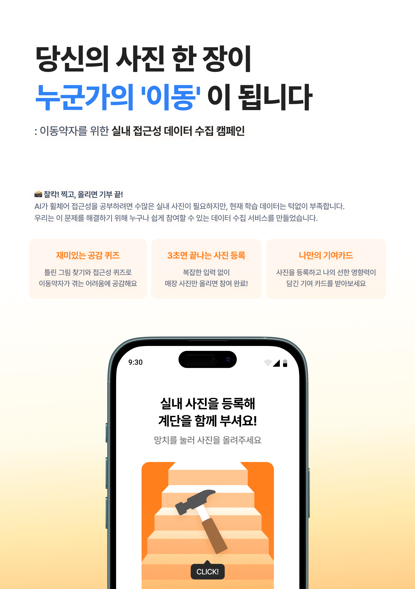
  
</p>

LAB 내 **실내 접근성 분석 AI 모델** 개발을 위한 [**데이터셋 수집 캠페인 서비스**](www.dongjeop.com/)입니다.

**공감형 퀴즈**를 통해 이동약자의 관점을 이해하고, 직접 촬영한 사진에 **접근성 정보를 라벨링**하여 AI 학습 데이터를 구축합니다. 참여 완료 시 **기여 카드**를 발급하고 SNS 공유 기능을 제공하여 캠페인 확산을 도모합니다.

- 🌍 이동약자의 접근성 불편 해소를 위한 사회적 인식 확대 및 공감 유도
- 📸 식당/카페 등의 실내 사진 데이터 수집
- 🏷️ 사용자 참여형 라벨링
- 🎮 게임화 요소를 통한 참여 동기 부여
- 🔗 SNS 공유를 통한 캠페인 확산

## ✨ 주요 기능

### 🎯 공감형 퀴즈

<div align="center">
  <table>
    <tr>
      <td align="center">
        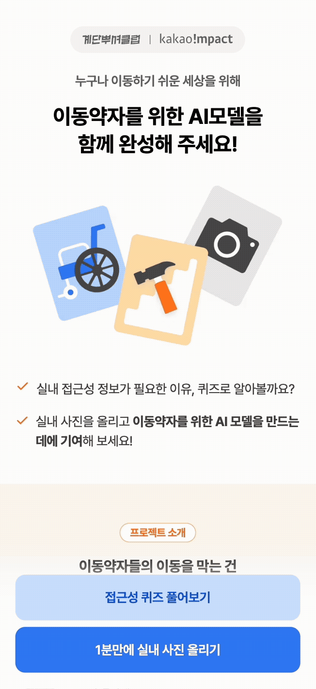
      </td>
      <td align="center">
        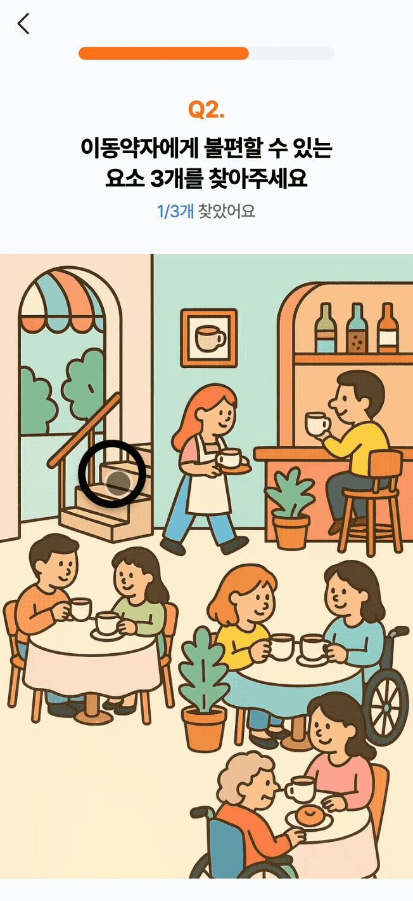
      </td>
      <td align="center">
        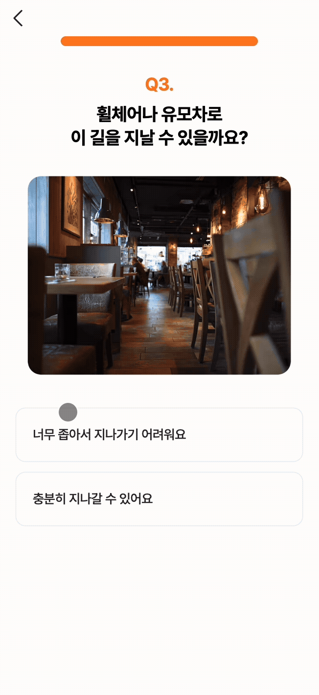
      </td>
    </tr>
  </table>
</div>

이동약자의 관점을 이해할 수 있는 3단계 퀴즈를 제공합니다.
- **Step 1, 3**: 계단, 통로 너비 등 물리적 접근성에 대한 OX 퀴즈
- **Step 2**: 틀린그림찾기 방식으로 실제 공간의 접근성 문제 발견
- 각 단계마다 정답과 해설을 함께 제공

### 📸 이미지 업로드

<div align="center">
    <table>
    <tr>
        <td>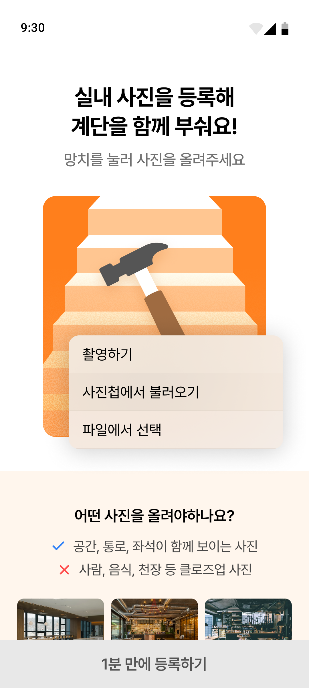</td>
        <td>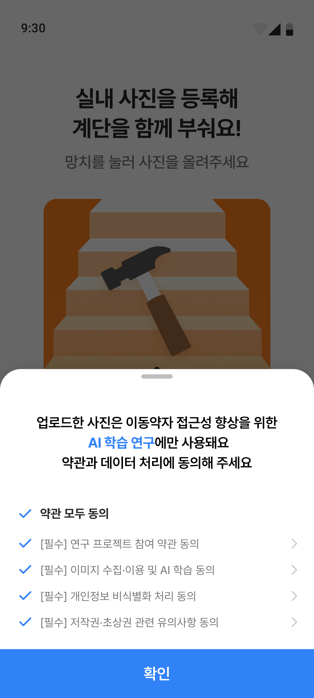</td>
        <td>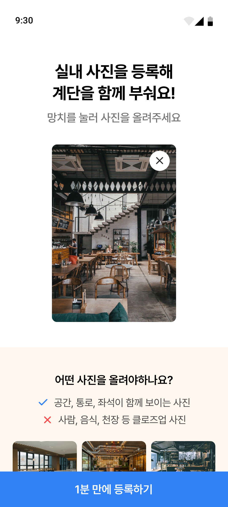</td>
    </tr>
    </table>
</div>

식당, 카페 등 실내 공간의 접근성 정보를 담은 사진을 쉽게 등록할 수 있습니다.
- 카메라 촬영 또는 갤러리에서 선택
- 업로드 가이드 제공
- 약관 동의를 통한 개인정보 보호

### 🏷️ 접근성 라벨링

<div align="center">
    <table>
    <tr>
        <td>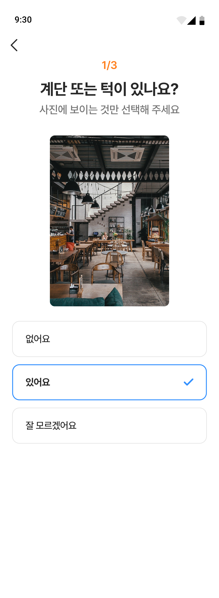</td>
        <td>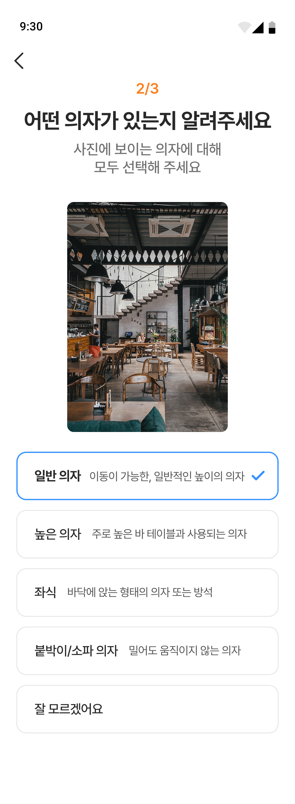</td>
        <td>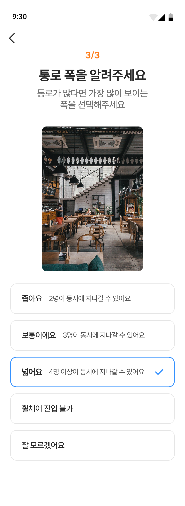</td>
    </tr>
    </table>
</div>

업로드한 이미지에 3단계에 걸쳐 접근성 정보를 입력합니다.
- 계단/턱 유무, 의자 종류, 통로 폭 등 세부 항목별 라벨링
- 간편한 입력 과정으로 참여 부담 최소화
- AI 학습을 위한 고품질 데이터 생성

### 🎁 기여 카드

<p align="center">
  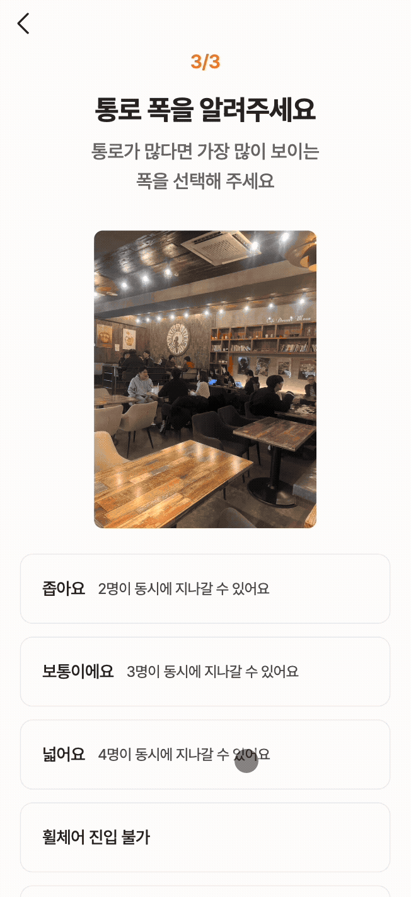
</p>

라벨링 완료 시 기여 카드를 발급받을 수 있습니다.
- 참여 순서가 표시된 개인화 카드 자동 생성
- 카드 이미지 다운로드
- 공유용 URL 복사

## 🛠️ 기술 스택

- **Core** : Next.js 15, React 19, TypeScript
- **State Management** : TanStack Query 5
- **Styling** : Tailwind CSS 4
- **Animation** : Motion, Lottie
- **Deployment**: Kakao Cloud, Docker
- **Dev Tools & Analytics**: ESLint, Prettier, Google Analytics

## 📊 시퀀스 다이어그램

### 📤 이미지 업로드 및 라벨링

```mermaid
sequenceDiagram
  autonumber
  actor User as 사용자
  participant Upload as 업로드
  participant API as 서버
  participant Label as 라벨링
  participant Finish as 완료

  User->>Upload: 이미지 선택 및 약관 동의
  Upload->>API: 이미지 업로드
  API-->>Upload: imageKey 발급
  
  Upload->>Label: 라벨링 페이지 이동
  User->>Label: 접근성 정보 입력 (3단계)
  Label->>API: 라벨링 데이터 저장
  
  Label->>Finish: 완료 페이지 이동
  User->>Finish: 기여 카드 다운로드
  User->>Finish: 공유 URL 복사
  ```

### 🎯 퀴즈

```mermaid
sequenceDiagram
  autonumber
  actor User as 사용자
  participant Quiz as 퀴즈 페이지
  participant Upload as 업로드 페이지

  User->>Quiz: /quiz 접근
  
  Note over User,Quiz: Step 1 - OX 퀴즈
  User->>Quiz: 답안 선택 (O/X)
  Quiz->>Quiz: 정답 여부 + 해설 표시
  User->>Quiz: 다음 버튼 클릭
  
  Note over User,Quiz: Step 2 - 틀린그림찾기
  User->>Quiz: 이미지 클릭 (접근성 문제 찾기)
  Quiz->>Quiz: 발견 영역 카운트
  Quiz->>Quiz: 모든 영역 발견 시 해설 표시
  User->>Quiz: 다음 버튼 클릭
  
  Note over User,Quiz: Step 3 - OX 퀴즈
  User->>Quiz: 답안 선택 (O/X)
  Quiz->>Quiz: 정답 여부 + 해설 표시
  User->>Quiz: 다음 버튼 클릭
  
  Quiz->>Upload: 업로드 페이지로 이동
```

## 📁 프로젝트 구조

**콜로케이션(Colocation) 패턴**을 사용해 기능별로 관련 파일을 한 곳에 모아 관리했습니다.

```
dongjeop-front/
├── .github/                    # GitHub 설정 (GitHub Actions CI/CD, 이슈/PR 템플릿)
├── public/                     # 정적 파일 (fonts, icons, images)
├── src/
│   ├── app/                   # Next.js App Router
│   │   ├── _components/       # 앱 전역 컴포넌트
│   │   ├── _utils/            # 앱 전역 유틸리티
│   │   ├── api/               # API 클라이언트
│   │   │
│   │   ├── label/             # 라벨링 기능
│   │   │   ├── [imageKey]/    # 동적 라우트
│   │   │   │   ├── _components/  # 페이지 전용 컴포넌트
│   │   │   │   ├── _hooks/       # 페이지 전용 훅
│   │   │   │   ├── _types/       # 페이지 전용 타입
│   │   │   │   ├── finish/       # 라벨링 완료 페이지
│   │   │   │   │   └── page.tsx  # /label/[imageKey]/finish
│   │   │   │   └── page.tsx      # /label/[imageKey]
│   │   │   └── upload/        # 이미지 업로드
│   │   │       └── page.tsx      # /label/upload
│   │   │
│   │   ├── quiz/              # 퀴즈 페이지
│   │   │   └── page.tsx          # /quiz
│   │   │
│   │   ├── terms/             # 약관 페이지
│   │   │   └── page.tsx          # /terms
│   │   │
│   │   ├── layout.tsx         # 루트 레이아웃
│   │   └── page.tsx           # 홈 /
│   │
│   ├── components/            # 전역 재사용 컴포넌트
│   │
│   ├── contexts/              # React Context (Tanstack Query Provider)
│   │
│   ├── lib/                   # 공통 유틸리티 및 설정
│   │   ├── constants.ts       # 전역 상수
│   │   ├── ga.ts              # Google Analytics
│   │   ├── path.ts            # 경로 관리
│   │   └── utils.ts           # 유틸리티 함수
│   │
│   └── types/                 # 전역 TypeScript 타입
│
├── Dockerfile                 # Docker 설정
├── docker-compose.yml         # Docker Compose 설정
├── next.config.ts             # Next.js 설정
├── package.json               # 의존성 관리
├── tsconfig.json              # TypeScript 설정
└── ...config files            # 기타 설정 파일
```
## 👥 팀원 소개

<div align="center">

| 양혜림 | 정유정 | 조재석 |
|:------:|:------:|:------:|
|  |  |  |
| FE | FE | FE |
| [GitHub](https://github.com/hyrmzz1) | [GitHub](https://github.com/dbwjd5864) | [GitHub](https://github.com/Pridesd) |

</div>